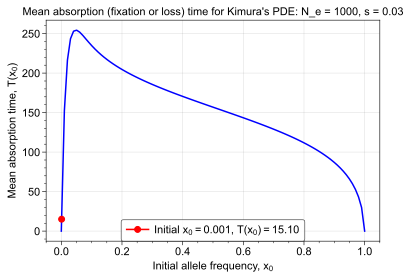

## Natural Selection and Genetic Drift Simulation

This code implements solutions to Kimura's drift-diffusion equation, using the PDE to find the time evolution of the probability density function (PDF) of allele frequencies in a population under the influence of genetic drift and natural selection. 

The code also simulates the corresponding stochastic differential equation (SDEs) to sample trajectories of allele frequencies over time, allowing for a comparison between the PDE solution and the SDE simulations.

Comparisons to theoretical results in population genetics are also included (fixation and loss probabilities).

## Usage

See `main.py` for an example, which can be run directly.

The editable parameters are:

- `Ne` (int, default = 100): Effective population size
- `s` (float, default = 0.003): Selection coefficient
- `Nx` (int, default = 1000): Number of spatial grid points for PDE
- `Nt` (int, default = 10000): Number of time steps for PDE
- `tmax` (float, default = 500.0): Maximum simulation time
- `x0` (float, default = 0.3): Initial allele frequency (mean)
- `sigma0` (float, default = 0.08): Standard deviation of initial allele frequency
- `n_paths` (int, default = 500): Number of SDE trajectories to simulate
- `seed` (int, default = 12345): Random seed for reproducibility

## Theory

Suppose we have a population of "effective" size *N_e*. At a particular locus (section of DNA), there are two **alleles** (variants of the DNA sequence), A and a, with frequencies *x* and 1 - *x*, respectively. 

Assuming random mating within the population, the dynamics of allele frequency over time is influenced by **genetic drift**, which is the random fluctuations (deviations from the expected frequencies under Hardy-Weinberg equilibrium) due to finite population size. 

If the allele A has some selective advantage (or disadvantage) over allele a, then Darwinian **natural selection** (differential reproductive success based on allele type) will also influence the allele frequency dynamics.

If the initial allele frequency of A (which we want to forecast into the future) is known to be exactly *x*_0 at initial time *t* = 0, we can represent this as a Dirac delta function:

$$ \phi(x, 0) = \delta(x - x_0) $$

where *φ(x, t)* is the probability density function of the allele frequency being *x* at time *t*.

The subsequent **evolution** (change in allele frequency over time) under the combined effect of genetic drift and natural selection can be described by Motoo Kimura's drift-diffusion (Fokker-Planck) equation, which is a partial differential equation (PDE):

$$ \frac{\partial \phi(x, t)}{\partial t} = -\frac{\partial}{\partial x} \left[ s x (1 - x) \phi(x, t) \right] + \frac{1}{2 N_e} \frac{\partial^2}{\partial x^2} \left[ x (1 - x) \phi(x, t) \right] $$

where *s* is the **selection coefficient** for allele A. This equation is the continuous-time limit of the Wright-Fisher model. The units of *t* are in number of generations.

In this code, the actual initial condition is approximated by a narrow Gaussian distribution centered at *x*_0 with a small standard deviation *σ*_0 (represents some uncertainty in the initial allele frequency).

To give this problem a unique solution, we require boundary conditions at *x* = 0 and *x* = 1. These are absorbing boundaries, meaning that if the allele frequency reaches either boundary, it will remain there (fixation or loss of the allele).

We have assumed that no new **mutations** occur during the simulation, so that the system remains with only two alleles. This is reasonable for short-term simulations as it is known that **standing variation** is the main source of genetic variation in populations, and new mutations are relatively rare events on a per-allele basis.

A suitable numerical method for solving this PDE (as a Fokker-Planck equation) is the Chang-Cooper scheme, which is a finite difference method that preserves the positivity and normalisation of the probability density function, which is used in this code.

To calculate the probability of fixation or loss of allele A, we define the probability flux *J(x, t)* as:

$$ J(x, t) = s x (1 - x) \phi(x, t) - \frac{1}{2 N_e} \frac{\partial}{\partial x} \left[ x (1 - x) \phi(x, t) \right] $$

such that the PDE can be rewritten as a continuity equation:

$$ \frac{\partial \phi(x, t)}{\partial t} = -\frac{\partial J(x, t)}{\partial x}. $$

The probability of **fixation** or **loss** of allele A is given by the time-integrated flux at each boundary respectively:

$$ P_{\text{fix}}(t) = \int_0^t J(1, \tau) d\tau \quad \quad P_{\text{loss}}(t) = \int_0^t J(0, \tau) d\tau $$

The probability that the allele frequency is still segregating (neither fixed nor lost) at time *t* is given by the remaining probability mass in the interior of the domain:

$$ P_{\text{seg}}(t) = \int_0^1 \phi(x, t) dx = 1 - P_{\text{fix}}(t) - P_{\text{loss}}(t). $$

To simulate individual trajectories of allele frequencies, we can use the corresponding Itô stochastic differential equation (SDE):

$$ dx = s x (1 - x) dt + \sqrt{\frac{x (1 - x)}{2 N_e}} dW_t $$

where *W_t* is the Wiener process (standard Brownian motion).

A suitable numerical method for generating sample paths of this SDE is the Milstein method, used in this code.

It can be shown that the mean time to absorption (fixation or loss) of the allele frequency at time *t* = 0 is given by the solution to the following BVP:

$$ T''(x) + 2 N_e s T'(x) = \frac{-2 N_e}{x(1 - x)}, \quad T(0) = T(1) = 0 $$

The mean absorption time from an initial allele frequency *x*_0 is then given by *T(x_0)*.

## Results

It can be seen visually that the PDE solution and the SDE simulations are in good agreement. The long-term fixation probability computed from the PDE solution matches that predicted by Kimura's formula:

$$ \lim_{t \to \infty} P_{\text{fix}}(t) = \frac{1 - e^{-2 N_e s x_0}}{1 - e^{-2 N_e s}} $$

In this simulation, parameters used were *N*_e = 20, *s* = 0.05, *x*_0 = 0.2, and *σ*_0 = 0.03. This represents drift just at the selection threshold since *N*_e * *s* = 1 - fixation is achieved with a non-zero probability, as expected.

The maximum error in the probability mass (computed as the greatest difference between the total probability at time *t* and 1) was on the order of 10^-13, showing the numerical solution is well-behaved.

If we vary the initial allele frequency, the mean absorption time has the following shape:

Some counter-intuitive but nonetheless accurate conclusions include:

- If *s* < 0 (deleterious allele), the allele can still be fixed in the population due to drift alone, especially if |*N*_e * *s*| << 1. In this case, the probability of fixation is a little less than *x*_0.
- If *s* = 0 (purely neutral allele), the probability of fixation is exactly equal to the initial allele frequency *x*_0. In this case, only genetic drift is acting. This is why neutral alleles can fix with relative ease in small populations, where the first mutant gives *x*_0 = 1 / *N*_e is not negligible.
- If *s* > 0 (beneficial allele), the probability of fixation is greater than *x*_0, but there is still a finite probability of loss due to drift, especially if *N*_e * *s* < 1.